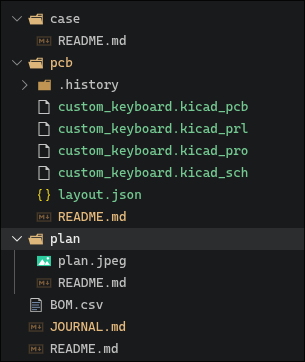
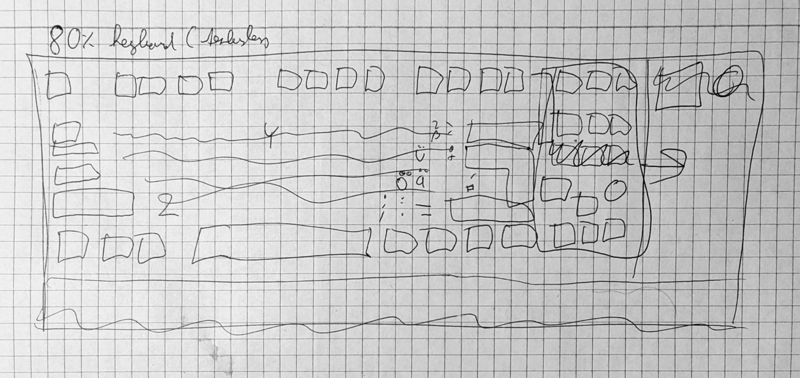
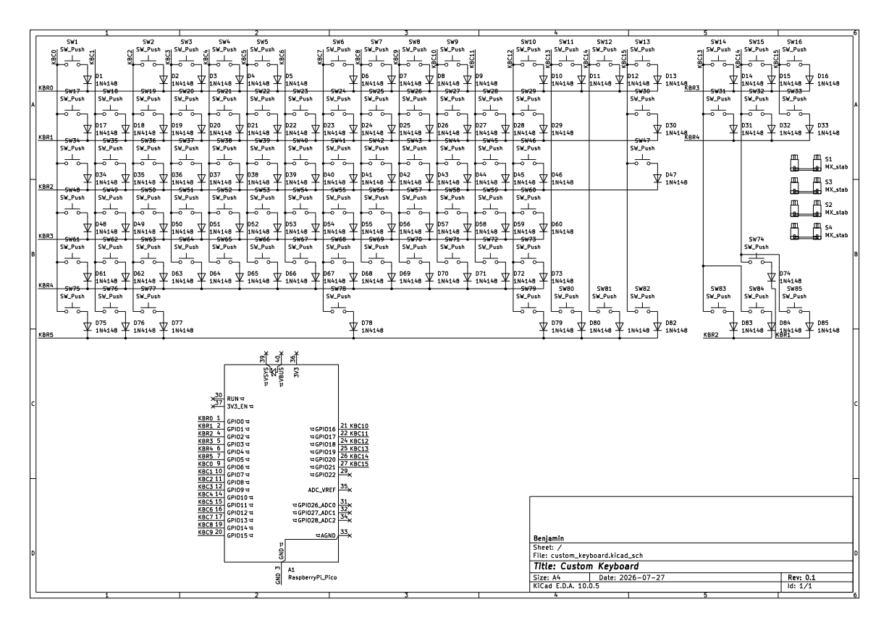
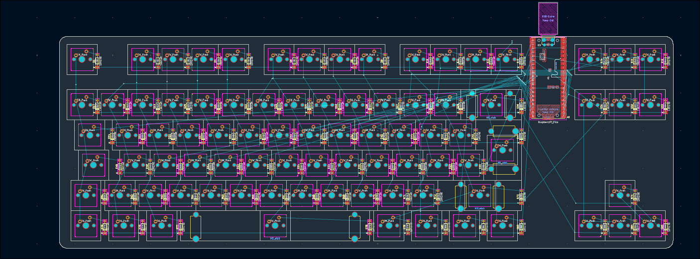
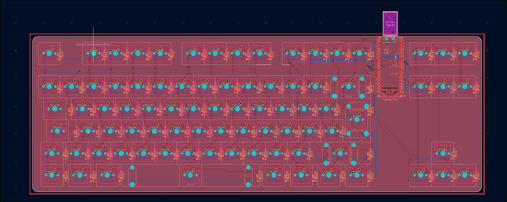
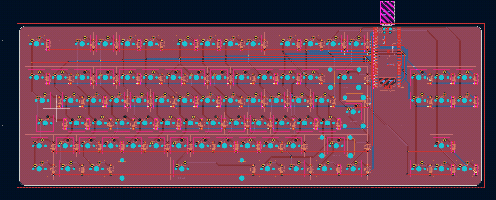
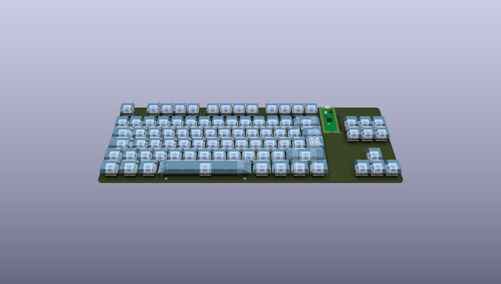
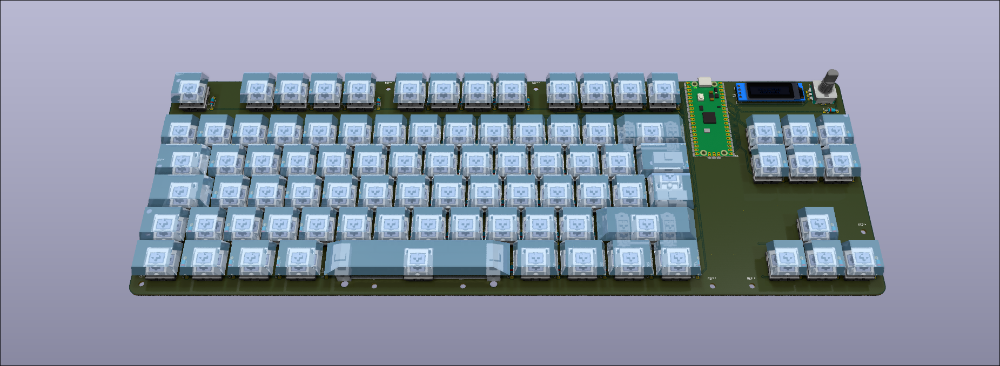
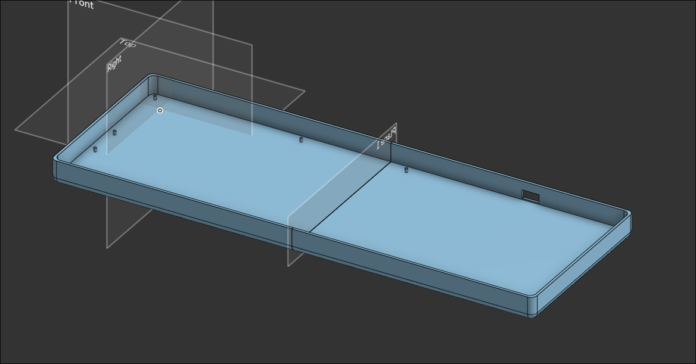
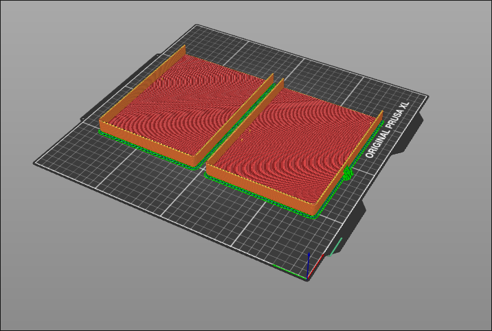

# Custom keyboard - Journal

## 2026-07-27: Starting the project

* Set up GitHub repository, add README.md and JOURNAL.md files, add filder structure, initialize KiCad project (~10m)
* Plan my Keyboard design (~5m)
* Design the schematic (~1h 5m)
* Start placing components on PCB (~20m)

## 2026-07-28: PCB design

* Continue placing components on PCB (~2h)
* Route the PCB (~1h 30m)

## 2026-07-29: PCB design

* Fix footprints, add 3d models (~30m)
* Export gerbers and BOM (~5m)

## 2026-07-29: Custom components

* add OLED display, Rotary Encoder, and fn key (~1h 30m)
* add mounting holes (~30m)

## 2026-07-31: Design Case

* Design the case for the keyboard (~1h 30m)
